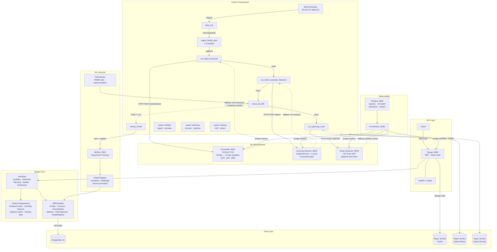

# FuelSense

**Energy logistics optimization platform with ML-driven demand forecasting, anomaly detection, and vehicle routing.**


---

## What FuelSense Does

FuelSense manages fuel inventory across a network of facilities — power plants, industrial sites, and storage depots. It forecasts demand 14 days ahead using temporal convolutional networks, detects consumption anomalies such as leaks, theft, and equipment degradation, and optimizes multi-depot vehicle routing to minimize delivery cost. A fully automated daily ML pipeline ingests data, generates forecasts, runs anomaly detection, monitors for model drift, triggers retraining when needed, and materializes optimized delivery routes — all orchestrated through Celery chord+chain pipelines with graceful degradation when any service is unavailable.

---

## Architecture



> **Reading the diagram:** Solid lines show primary data flow. Dashed lines show fallback paths used when a service is unavailable. Port numbers are default container ports. The daily pipeline flows top-to-bottom through the Celery orchestration layer, calling ML microservices via HTTP and persisting results back through the ORM.

---

## Key Capabilities

- **Demand Forecasting** — 3-block Temporal Convolutional Network with residual connections and quantile loss (p10/p50/p90). Ingests a 90-day lookback window of 6 engineered features (consumption, temperature, wind speed, solar irradiance, cyclical day-of-week encoding) and produces 14-day ahead demand predictions per facility.

- **Anomaly Detection** — Two-stage pipeline: z-score thresholding (σ > 3.0) followed by Isolation Forest scoring across 7 engineered features (z-score, rolling 3-day z-score, consumption delta %, temperature residual, day of week, hours since delivery, inventory level %). Classifies into 5 types: `LEAK`, `THEFT`, `EQUIPMENT_DEGRADATION`, `DEMAND_SHIFT`, `SENSOR_FAULT`.

- **Route Optimization** — Google OR-Tools constraint programming solver for capacitated vehicle routing. Adaptive time limits scale with fleet size (2s small / 6s medium / 10s large). Haversine distance matrix with SHA256-keyed Redis caching. Parallel depot optimization via `ThreadPoolExecutor`.

- **Dynamic Reorder Points** — Forecast-driven reorder calculation (p90 × lead_time × 1.1 safety margin) with a 3-tier fallback chain: (1) forecast-based, (2) preserved prior value, (3) local heuristic (7-day avg consumption × lead_time × 1.1).

- **Drift Monitoring** — RMSE ratio tracking per model with configurable threshold (default 1.5×). Automatically enqueues retraining tasks for drifting facilities. Champion/challenger validation: new models only promoted if validation RMSE improves over the active model.

- **Emergency Planning** — API-triggered per-facility optimizer dispatch with partial success tolerance, async status tracking via `PlanningCycle` state machine (`QUEUED` → `RUNNING` → `COMPLETED` / `FAILED`).

---

## Tech Stack

| Layer | Technology | Version |
|---|---|---|
| API Framework | Django + Django REST Framework | 5.2 / 3.16 |
| Task Queue | Celery + Redis | 5.6 / 7 |
| Demand Forecasting | PyTorch (Temporal Convolutional Network) | 2.10 |
| Anomaly Detection | scikit-learn (Isolation Forest) | 1.8 |
| Route Optimization | Google OR-Tools (CP-SAT) | 9.15 |
| ML Tracking | MLflow | 3.10 |
| Database | PostgreSQL | 16 |
| Observability | Prometheus + Grafana | 2.50 / 10.3 |
| Container Runtime | Docker Compose / Helm | — |
| Language | Python | 3.13 |

---

## Project Structure

```
fuelsense/                  Django project — settings, URLs, ASGI/WSGI, Celery app
  core/                     Domain models, API views, tasks, feature engineering, metrics
  settings/                 Environment-specific settings (base, development, production)
  synthetic/                Synthetic data generators (consumption, weather, anomalies)
forecaster/                 Demand forecasting microservice — DemandTCN model + FastAPI
  backends/                 CPU and GPU compute backends
anomaly/                    Anomaly detection microservice — IsolationForest + FastAPI
optimizer/                  Route optimization microservice — OR-Tools VRP + FastAPI
  backends/                 CPU and GPU compute backends
fuelsense_common/           Shared library — ComputeBackend protocol, registry, Pydantic schemas
ml_pipeline/                Offline ML pipeline — training, drift monitoring, anomaly training
charts/fuelsense/           Helm chart — Kubernetes manifests for production deployment
infra/                      Infrastructure config — Prometheus, Grafana dashboards, Kind
requirements/               Per-service dependency files (base, forecaster, anomaly, optimizer, dev)
typings/                    Local type stubs (ortools, torch, sklearn, celery, etc.)
```

---

## Getting Started

### Prerequisites

- Python 3.13+
- PostgreSQL 16
- Redis 7
- Docker & Docker Compose (for containerized setup)

### Quick Start (Docker Compose)

Start all 13 services with health checks:

```bash
docker compose up --build -d
```

For GPU-accelerated forecaster and optimizer (requires NVIDIA GPU + drivers):

```bash
docker compose -f docker-compose.yml -f docker-compose.gpu.yml up --build -d
```

Services will be available at:

| Service | URL |
|---|---|
| Django API | http://localhost:8000 |
| Forecaster | http://localhost:8001 |
| Anomaly Detector | http://localhost:8002 |
| Route Optimizer | http://localhost:8003 |
| MLflow | http://localhost:5000 |
| Prometheus | http://localhost:9090 |
| Grafana | http://localhost:3000 |

### Local Development

```bash
# Install Django + dev dependencies
make install

# Or install all CPU service dependencies
make install-all

# Configure environment, run migrations, seed data
source .env.example
make migrate
make seed          # 50 facilities, 365 days of synthetic data

# Run the full test suite (95% coverage gate)
make test
```

### Available Make Targets

| Target | Description |
|---|---|
| `make install` | Install Django/base + dev dependencies |
| `make install-forecaster` | Install forecaster CPU + dev dependencies |
| `make install-anomaly` | Install anomaly + dev dependencies |
| `make install-optimizer` | Install optimizer CPU + dev dependencies |
| `make install-all` | Install all CPU service dependencies + dev |
| `make lint` | Run Ruff lint and format checks |
| `make typecheck` | Run mypy static type checks |
| `make test` | Full test suite with coverage gate |
| `make test-django` | Django tests only |
| `make test-ml` | ML service tests (forecaster + anomaly) |
| `make test-optimizer` | Optimizer tests only |
| `make test-all` | All tests with XML coverage report |
| `make migrate` | Apply Django migrations |
| `make seed` | Generate synthetic data |
| `make train-all` | Trigger model training pipeline |
| `make bench-forecaster` | Run forecaster benchmarks (CPU + GPU) |
| `make bench-optimizer` | Run optimizer benchmarks (CPU + GPU) |
| `make k8s-local` | Deploy to local Kind cluster |
| `make k8s-local-gpu` | Deploy with GPU values to Kind cluster |
| `make k8s-down` | Tear down Kind cluster |

---

## Development & Quality Gates

### Static Analysis

- **Linting**: Ruff with **ALL** rules enabled, line-length 120, targeting Python 3.13
- **Type Checking**: mypy in `--strict` mode with `django-stubs` plugin, zero `ignore_missing_imports`, local type stubs for all third-party packages
- **Format Checking**: Ruff format enforced in CI

### Testing

- **35 test files** across all packages with `pytest`
- **95% code coverage floor** enforced via `pytest-cov` (`--cov-fail-under=95`)
- **Property-based tests** via Hypothesis
- **Strict markers**: `slow`, `gpu`, `integration`
- **Coverage exclusions**: GPU backends (require hardware), migrations, test files

### CI Branch Protection

All of the following checks must pass before merging to `main`:

| Check | Scope |
|---|---|
| `lint-and-typecheck` | Ruff + mypy across all packages |
| `test-django` | Django core + synthetic tests |
| `test-training-integration` | ML pipeline integration tests |
| `test-ml-services` | Forecaster + anomaly + optimizer tests |
| `validate-helm` | Helm chart linting and template validation |
| `build-images` | Docker image builds for all services |

Additional requirements: 1 approving review, stale approvals dismissed on new commits, no force pushes, no bypass — including administrators.

---

## Deployment

### Docker Compose (Development / Staging)

The `docker-compose.yml` defines 13 services with staged health checks and dependency ordering:

| Service | Image | Port | Health Check |
|---|---|---|---|
| PostgreSQL 16 | `postgres:16` | 5432 | `pg_isready` |
| Redis 7 | `redis:7-alpine` | 6379 | `redis-cli ping` |
| Django | `Dockerfile.django` | 8000 | `curl /healthz` |
| Celery Default | `Dockerfile.django` | — | `celery inspect ping` |
| Celery Training | `Dockerfile.django` | — | `celery inspect ping` |
| Celery Planning | `Dockerfile.django` | — | `celery inspect ping` |
| Celery Beat | `Dockerfile.django` | — | `pgrep celery beat` |
| Forecaster | `Dockerfile.forecaster` | 8001 | HTTP `/health` |
| Anomaly Detector | `Dockerfile.anomaly` | 8002 | HTTP `/health` |
| Route Optimizer | `Dockerfile.optimizer` | 8003 | HTTP `/health` |
| MLflow | `ghcr.io/mlflow/mlflow:v2.11.0` | 5000 | HTTP `/` |
| Prometheus | `prom/prometheus:v2.50.0` | 9090 | HTTP `/-/healthy` |
| Grafana | `grafana/grafana:10.3.0` | 3000 | HTTP `/api/health` |

### Kubernetes (Helm)

```bash
# Local Kind cluster
make k8s-local

# With GPU support
make k8s-local-gpu

# Tear down
make k8s-down
```

Helm chart highlights (v0.2.0):

- **Auto-scaling**: HPA on forecaster (1 → 4 replicas at 70% CPU utilization)
- **Resource isolation**: Training workers get 1–2 CPU / 2–4 GiB; default workers get 250–500m CPU / 512 MiB–1 GiB
- **GPU scheduling**: `nodeSelector: accelerator: nvidia` with tolerations for NVIDIA GPU taints
- **Network Policy**: Enabled by default — restricts inter-service communication
- **Ingress**: nginx ingress class at `fuelsense.local`
- **Monitoring**: Prometheus + Grafana with 4 pre-built dashboards (logistics, ml-health, operations, system)

---

## Configuration

FuelSense is configured through environment variables (see `.env.example` for all options):

| Variable | Default | Description |
|---|---|---|
| `FUELSENSE_DEVICE` | `auto` | Compute device: `auto`, `cpu`, or `cuda` |
| `FUELSENSE_ENABLE_REMOTE_FORECAST` | `1` | Enable remote forecaster service calls |
| `FUELSENSE_ENABLE_REMOTE_ANOMALY` | `1` | Enable remote anomaly detection calls |
| `FUELSENSE_ENABLE_REMOTE_OPTIMIZER` | `1` | Enable remote optimizer service calls |
| `FUELSENSE_REQUIRE_REMOTE_SERVICES` | `0` | If `1`, fail hard when remote services are unavailable |
| `FUELSENSE_PLANNING_PARALLEL_DEPOTS` | `1` | Enable parallel depot optimization |
| `FUELSENSE_PLANNING_PARALLEL_WORKERS` | CPU count | Thread pool size for parallel optimization |
| `FUELSENSE_ENABLE_DAILY_TICK` | `1` | Enable the daily orchestration pipeline |
| `FUELSENSE_ENABLE_TRAINING_TASKS` | `1` | Enable model retraining tasks |
| `FUELSENSE_FORECAST_BATCH_SIZE_CPU` | `16` | Forecaster batch size (CPU mode) |
| `FUELSENSE_FORECAST_BATCH_SIZE_GPU` | `256` | Forecaster batch size (GPU mode) |

---

## API Overview

All endpoints require token authentication (`POST /api/v1/auth/token/`) except health probes.

| Endpoint Group | Key Endpoints | Description |
|---|---|---|
| **Health** | `GET /healthz`, `GET /readyz` | Liveness (DB + cache) and readiness (DB) probes |
| **Facilities** | `GET /api/v1/facilities/`, `GET .../inventory/`, `GET .../forecasts/`, `GET .../alerts/` | CRUD + inventory time-series, forecasts, anomaly alerts |
| **Deliveries** | `GET /api/v1/deliveries/`, `POST .../update-status/` | Delivery tracking with validated state machine transitions |
| **Planning** | `POST /api/v1/planning/trigger/`, `GET .../history/` | Manual/emergency planning triggers (202 Accepted), cycle history |
| **Models** | `GET /api/v1/models/`, `POST .../promote/`, `POST .../retrain/` | Model registry, version promotion, retraining triggers |
| **Dashboard** | `GET /api/v1/dashboard/kpis/`, `GET .../drift-heatmap/` | Cached KPI aggregations (5 min TTL), per-model drift heatmap |

---

## License

This project is licensed under the MIT License — see the [LICENSE](LICENSE) file for details.
